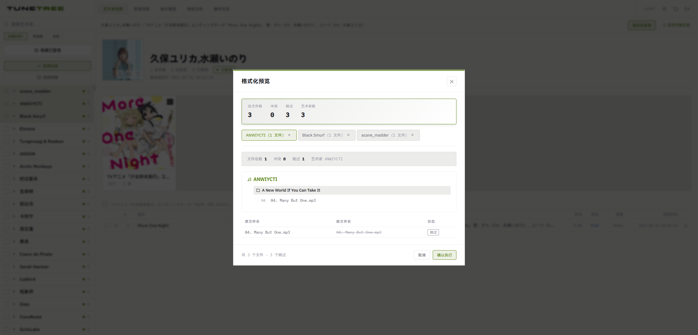
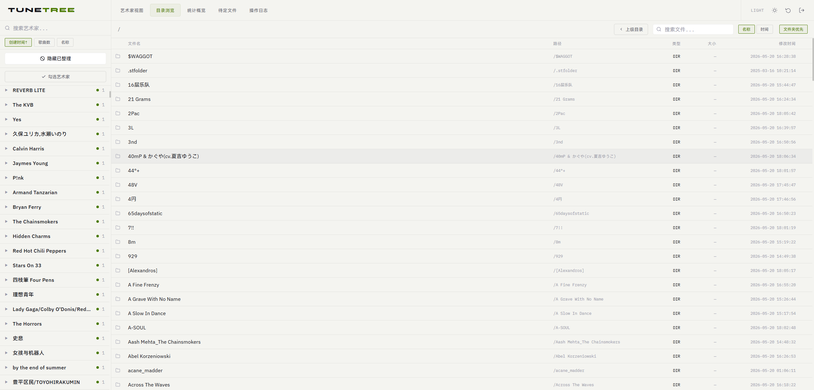
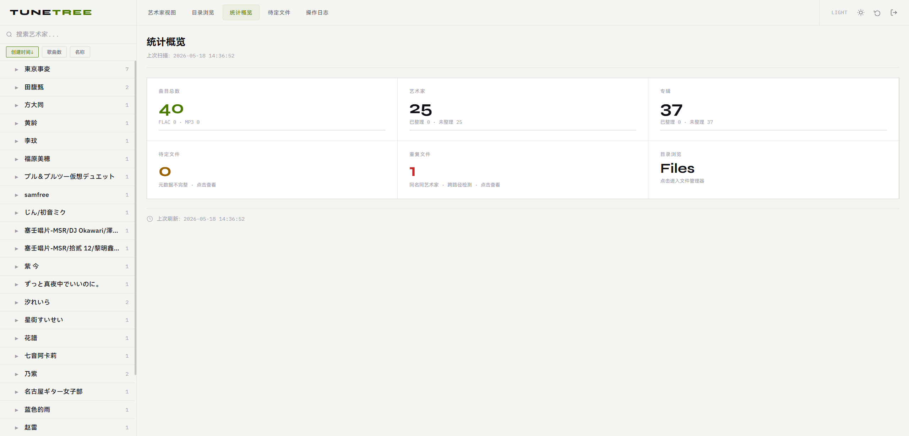
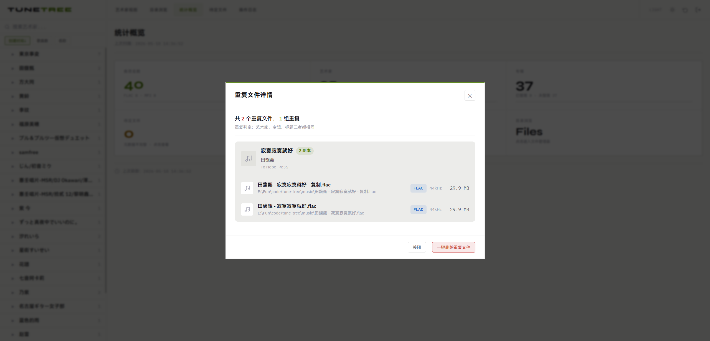
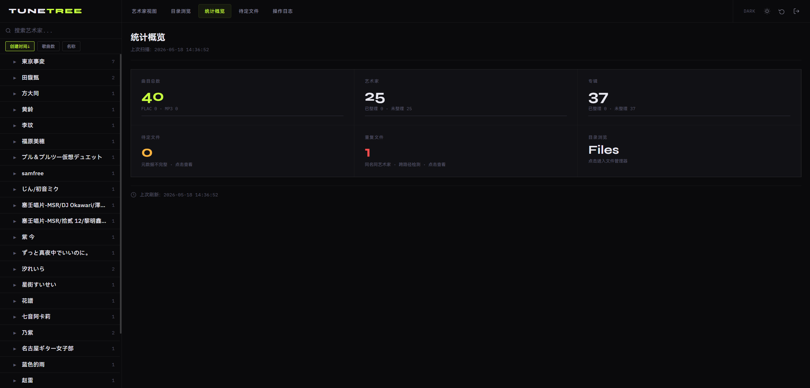

<p align="center">
  
</p>

<h1 align="center">Tune Tree</h1>

<p align="center">
  <strong>自托管音乐库整理工具</strong>
</p>

<p align="center">
  扫描、浏览、重组本地音乐收藏，提供简洁的 Web 界面。<br>
  自动读取元数据、检测重复文件、批量整理。
</p>

<p align="center">
  <a href="#功能特性">功能特性</a> &middot;
  <a href="#快速开始">快速开始</a> &middot;
  <a href="#配置">配置</a> &middot;
  <a href="#api-一览">API 一览</a> &middot;
  <a href="#命名规则">命名规则</a>
</p>

***

## 功能特性

- **目录扫描** -- 递归扫描音乐根目录，将所有曲目索引到 SQLite，支持并行处理提高效率
- **元数据读取** -- 通过 mutagen 提取 ID3v2 / Vorbis Comment 标签、内嵌封面和歌词
- **元数据刮削** -- 自动从网易云音乐、酷狗、Spotify 获取缺失的元数据和封面
- **Web 浏览** -- 按艺术家、专辑、曲目浏览，单页前端界面，支持夜间模式
- **文件格式化** -- 预览并执行批量重命名与移动，整理为 `{艺术家}/{专辑}/` 目录结构，支持多艺术家批量操作
- **重复检测** -- 识别音乐库中的重复文件
- **待定文件** -- 列出缺少完整元数据的文件，支持在线编辑元数据
- **访问控制** -- 基于 Token 的简单认证

## 平台预览

### 艺术家列表及详情


### 编辑元数据


### 搜索元数据标签


### 搜索歌词、编辑歌词和时间轴


### 单艺术家格式化预览


### 多选艺术家格式化预览



### 目录浏览


### 艺术家多选格式化


### 专辑多选可视化


### 统计概览


### 重复文件详情


### 夜间模式


## 技术栈

| 分类       | 技术                  | 版本    |
| -------- | ------------------- | ----- |
| 语言       | Python              | 3.13  |
| Web 框架   | Flask               | 3.0+  |
| 模板引擎     | Jinja2              | --    |
| 数据库      | SQLite3             | --    |
| 音频元数据    | mutagen             | 1.47+ |
| WSGI 服务器 | Gunicorn / Waitress | --    |

## 快速开始

```bash
# 1. 进入后端目录
cd python

# 2. 安装依赖
pip install -r requirements.txt

# 3. 设置音乐根目录（默认 /music，可通过环境变量覆盖）
# Windows
set MUSIC_ROOT=D:\Music
# Linux / macOS
export MUSIC_ROOT=/path/to/your/music

# 4. 启动（开发模式）
python app.py
```

浏览器打开 <http://localhost:5000>，默认密钥 `tunetree-2024`

### 生产部署

```bash
# Linux / macOS
gunicorn wsgi:application -w 4 -b 0.0.0.0:5000

# Windows
pip install waitress
waitress-serve --host=0.0.0.0 --port=5000 wsgi:application
```

## 配置

在 `python/config.py` 中修改：

| 变量           | 默认值                              | 说明              |
| ------------ | -------------------------------- | --------------- |
| `ACCESS_KEY` | `tunetree-2026`                  | 登录密钥            |
| `SECRET_KEY` | `change-me-in-production-please` | Flask 会话密钥      |
| `MUSIC_ROOT` | `/music`                         | 音乐根目录（优先使用环境变量） |
| `DB_PATH`    | `instance/library.db`            | 数据库路径           |

> **安全提醒**：生产环境必须修改 `ACCESS_KEY` 和 `SECRET_KEY`

## 项目结构

```
tune-tree/
├── python/                    # 后端主目录
│   ├── api/                   # API 路由层
│   │   └── routes.py          # API 端点定义
│   ├── services/              # 业务逻辑层
│   │   ├── scan_service.py       # 目录扫描服务
│   │   ├── format_service.py     # 文件格式化服务
│   │   └── metadata_scraper.py   # 元数据刮削服务
│   ├── repository/            # 数据访问层
│   │   └── track_repository.py   # 曲目数据操作
│   ├── models/                # 数据模型层
│   │   └── db.py              # 数据库连接与初始化
│   ├── utils/                 # 工具层
│   │   ├── metadata.py        # 元数据读取工具
│   │   └── formatting.py      # 格式化工具函数
│   ├── static/                # 静态资源
│   │   ├── css/main.css
│   │   └── js/                # 前端 JavaScript
│   ├── templates/
│   │   └── index.html         # 单页前端
│   ├── instance/              # 应用数据
│   │   ├── library.db         # SQLite 数据库
│   │   └── tunetree.log       # 操作日志
│   ├── app.py                 # Flask 应用入口
│   ├── config.py              # 配置文件
│   ├── requirements.txt
│   └── wsgi.py                # Gunicorn / Waitress 入口
├── screenshots/               # 平台预览截图
├── conf/                      # 配置文件
├── Dockerfile                 # Docker 构建文件
├── docker-compose.yml         # Docker Compose 配置
└── LICENSE                    # GPLv3
```

## API 一览

所有接口需要 `X-Token` 请求头（值为 ACCESS\_KEY）。

| 方法     | 路径                                            | 说明                   |
| ------ | --------------------------------------------- | -------------------- |
| POST   | `/api/auth/verify`                            | 验证 token             |
| POST   | `/api/logout`                                 | 登出                   |
| POST   | `/api/scan`                                   | 扫描音乐目录               |
| GET    | `/api/artists`                                | 获取艺术家列表（支持 `?q=` 搜索） |
| GET    | `/api/artists/{artist}/albums`                | 获取专辑列表               |
| GET    | `/api/artists/{artist}/albums/{album}/tracks` | 获取曲目列表               |
| GET    | `/api/tracks/{id}`                            | 获取单曲详情（含歌词）          |
| GET    | `/api/cover/{id}`                             | 获取专辑封面（图片）           |
| GET    | `/api/files?path=`                            | 目录浏览                 |
| GET    | `/api/stats`                                  | 统计数据                 |
| GET    | `/api/pending`                                | 待定文件列表               |
| GET    | `/api/duplicates`                             | 重复文件列表               |
| POST   | `/api/format/preview`                         | 格式化预览                |
| POST   | `/api/format/execute`                         | 执行格式化（移动+重命名）        |
| GET    | `/api/logs`                                   | 操作日志                 |
| DELETE | `/api/logs`                                   | 清空日志                 |

## 命名规则

格式化后文件名：`曲序号. 曲目名[ - feat. 客串].扩展名`

示例：

```
{MUSIC_ROOT}
├── Michael Jackson
│   └── HIStory_ Past, Present and Future, Book I
│       └── 05. Earth Song.flac
└── Babyface_Kenny G
    └── Love Ballads
        └── 04. Every Time I Close My Eyes.flac
```

目录结构：`{MUSIC_ROOT}/{艺术家}/{专辑}/`

## 支持格式

| 格式      | 标签标准           | 封面   | 歌词   |
| ------- | -------------- | ---- | ---- |
| `.mp3`  | ID3v2          | APIC | USLT |
| `.flac` | Vorbis Comment | 内嵌   | 歌词字段 |

## Windows / Linux 特殊字符处理

支持跨平台处理特殊字符限制。

### 不允许的字符

以下字符会被自动替换为下划线 `_`：

| 字符 | Windows | Linux | 说明           |
| ---- | ------- | ----- | ------------ |
| `\`  | ❌      | ✅    | 反斜杠（目录分隔符） |
| `/`  | ❌      | ❌    | 正斜杠（目录分隔符） |
| `:`  | ❌      | ✅    | 冒号          |
| `*`  | ❌      | ✅    | 星号（通配符）    |
| `?`  | ❌      | ✅    | 问号（通配符）    |
| `"`  | ❌      | ✅    | 双引号         |
| `<`  | ❌      | ✅    | 小于号         |
| `>`  | ❌      | ✅    | 大于号         |
| `|`  | ❌      | ✅    | 竖线          |

### 其他处理规则

1. **控制字符**：ASCII `\x00-\x1f` 和 `\x7f` 会被移除
2. **首字符处理**：
   - 以 `-` 开头会被替换为 `_`（避免被误认为命令行选项）
3. **尾字符处理**：
   - 以 `.` 结尾会被替换为 `_`（Windows 不允许目录名以点号结尾）
4. **保留名称**：
   - Windows 保留名称（`CON`, `PRN`, `AUX`, `NUL`, `COM1-9`, `LPT1-9`）会自动添加下划线后缀
5. **空名称处理**：
   - 如果处理后名称为空或只有特殊字符，会使用 `Unknown` 作为默认名称

### 示例

```
原始名称                    → 处理后名称
------------------------   → ------------------------
Michael: Jackson           → Michael_Jackson
Album / Best Of            → Album _ Best Of
"Classic" Hits             → _Classic_ Hits
-rock ballads              → _rock ballads
README.                    → README_
CON                        → CON_
aux                        → aux_
```

### 代码实现

特殊字符处理逻辑位于 `python/utils/formatting.py`：

```python
def safe_dirname(name: str) -> str:
    # 1. 替换跨平台非法字符（Windows: \/:*?"<>|，Linux: /）
    result = re.sub(r'[\\/:*?"<>|]', "_", name)
    
    # 2. 移除控制字符（ASCII 0-31 和 127）
    result = re.sub(r"[\x00-\x1f\x7f]", "", result)
    
    # 3. 去除首尾空格
    result = result.strip()
    
    # 4. 处理 Linux 特殊开头字符（以 - 开头）
    if result.startswith("-"):
        result = "_" + result[1:]
    
    # 5. 将结尾的点号替换为下划线
    result = re.sub(r"\.+$", "_", result)
    
    # 6. 检查 Windows 保留名称
    windows_reserved = {
        "con", "prn", "aux", "nul",
        "com1-9", "lpt1-9"
    }
    if result.lower() in windows_reserved:
        result = result + "_"
    
    # 7. 如果处理后为空或只有特殊字符，返回 Unknown
    return result or "Unknown"
```

